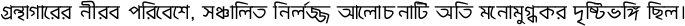
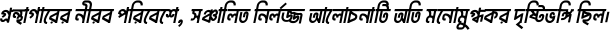
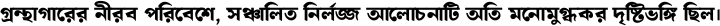
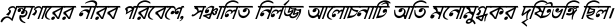
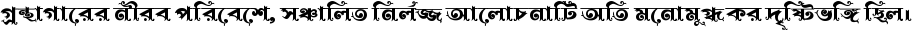
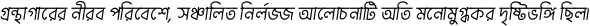

<h1>Bangla Font Preview Gallery</h1>

This gallery showcases images generated with different fonts.

<h2>1. Harappa Lipi.ttf</h2>

<h2>2. FN Shorif Opekkha Matrahin Unicode-Italic_1.ttf</h2>

<h2>3. FN Nuralam Shakh Mujib Unicod-Italic.otf</h2>

<h2>4. FN Al Amin Sohochori Uni&BE.ttf</h2>

<h2>5. Shorif Shumona Unicode Italic.ttf</h2>

<h2>6. mitra.ttf</h2>

<h2>7. Manha Jhankaar Unicode Italic.otf</h2>

<h2>8. Shorif Teesta.ttf</h2>

<h2>9. FN Liakot Bangladeshi Unicode Italic.otf</h2>

<h2>10. FN Sweet Soma  Unicode.ttf</h2>

<h2>11. Manha Jhankaar (Design)  Unicode.otf</h2>

<h2>12. FN Mamun Masud Italic Unicode.ttf</h2>

<h2>13. FN Aysha Unicode & BE Italic.ttf</h2>

<h2>14. FN Shorif Ganga Uni+BE.ttf</h2>

<h2>15. FN NuralamZainulAbedin Unicode Light.ttf</h2>

<h2>16. Kopotakkho Unicode Regular.ttf</h2>

<h2>17. Sultan Shoilpic S_A_U FF.ttf</h2>

<h2>18. FN Shishir Stylo Unicode Light.ttf</h2>

<h2>19. Shorif_Suborno_Rounded_Unicode.ttf</h2>

<h2>20. FN Mahfuj AA Borna Unicode Italic.ttf</h2>

<h2>21. Shobuj Nolua Unicode.ttf</h2>

<h2>22. Afrinagar normal matra Regular.ttf</h2>

<h2>23. NikoshLight.ttf</h2>

<h2>24. UNBangla-Outline.ttf</h2>

<h2>25. Dhaleshwari Italic.ttf</h2>

<h2>26. Prapti_MM Italic.ttf</h2>

<h2>27. Shorif_Suborno_Rounded_italic_Unicode.ttf</h2>

<h2>28. FNMahinPriotomaUnicodeItalic-Regular.ttf</h2>

<h2>29. FN Nihal Adrita Unicode.ttf</h2>

<h2>30. FN Mahfuj Raiyan-Medium-Italic.ttf</h2>

<h2>31. FN Mamun Turio Unicode Thin Italic.ttf</h2>

<h2>32. FN  Mahfuj Okkhor Unicode.ttf</h2>

<h2>33. FN Mahfuj Raiyan-Black.ttf</h2>

<h2>34. Motiur Rahman Unicode.ttf</h2>

<h2>35. UNBangla-BoldItalic.ttf</h2>

<h2>36. FN Bangla Borno Unicode.ttf</h2>

<h2>37. FN Saeed Hostolipi Lite Italic Uni+Borno.ttf</h2>

<h2>38. FN-Rojhan-Lipika-Semi-Bold.ttf</h2>

<h2>39. Mamun Ahnaf Unicode.ttf</h2>

<h2>40. FN Al Amin Bindu Uni+BE Italic.ttf</h2>

<h2>41. FN-Rojhan-Lipika-Semi-Bold-Italic.ttf</h2>

<h2>42. FN-Lipika-Azhari-Medium-Italic.ttf</h2>

<h2>43. FN Tripura Sundori Uniccode+Borno Encoding Italic.ttf</h2>

<h2>44. FN Baraka Bangla Unicode Italic.otf</h2>

<h2>45. FN Mizan Swapna UNI & BE.ttf</h2>

<h2>46. FN Premi S_A_U Italic.ttf</h2>

<h2>47. FN Shamim Jhinuk Unicode.ttf</h2>

<h2>48. FN Momenshahi Bangla Unicode Italic.otf</h2>

<h2>49. Fn Shorif Amina Unicode Bold Italic.ttf</h2>

<h2>50. FN Hasan Jhora Pata Italic.otf</h2>

<h2>51. Birsreshtho Mustafa Kamal Italic Unicode.ttf</h2>

<h2>52. FN Aysha Unicode & BE.ttf</h2>

<h2>53. FN Mahin Shorif Unicode Italic.ttf</h2>

<h2>54. FN Badhon Janani52 Unicode Italic.ttf</h2>

<h2>55. FN Mamun Turio Unicode Semi-bold.ttf</h2>

<h2>56. Mashrafe Torongo Unicode.ttf</h2>

<h2>57. FN Shishir Stylo Unicode Bold Italic.ttf</h2>

<h2>58. FN Al-Aqsa-Unicode.ttf</h2>

<h2>59. Shorif Shishir Unicode.ttf</h2>

<h2>60. FN Shishir Stylo Unicode Regular Italic.ttf</h2>

<h2>61. FN Saeed Hostolipi Lite Uni+Borno.ttf</h2>

<h2>62. Nikosh.ttf</h2>

<h2>63. FN Sohanur Nithila Uniccode+Borno Encoding Italic.ttf</h2>

<h2>64. Karu Ahasan Unicode.ttf</h2>

<h2>65. muktinarrow.ttf</h2>

<h2>66. FN Saeed Hostolipi Bold Uni+Borno.ttf</h2>

<h2>67. Lohit_14-04-2007.ttf</h2>

<h2>68. FN Mahfuz Mimma Uni&BE.ttf</h2>

<h2>69. Kazi Typo Unicode Thin.ttf</h2>

<h2>70. FN Nuralam Sheikh Mujib Unicode Regular.ttf</h2>

<h2>71. Shobuj Bhulua Unicode.ttf</h2>

<h2>72. FNMahinPriotoma2UnicodeItalic-Regular.ttf</h2>

<h2>73. UNBangla-Italic.ttf</h2>

<h2>74. FN Mamun Bornolipi Unicode.ttf</h2>

<h2>75. Fn Shorif Amina Unicode Medium.ttf</h2>

<h2>76. FN Shorif Opekkha Unicode.ttf</h2>

<h2>77. FN Helal Tammi Unicode.otf</h2>

<h2>78. Mukti_1.99_PR.ttf</h2>

<h2>79. AponaLohit.ttf</h2>

<h2>80. Durbar.ttf</h2>

<h2>81. akaashnormal (1).ttf</h2>

<h2>82. FN Hasan Priyotoma Unicode Italic.ttf</h2>

<h2>83. FN Sattar Sir Unicode Italic.ttf</h2>

<h2>84. FN_Mahfuj_Headline_Thin_Unicode.otf</h2>

<h2>85. Afrinagar Italic.ttf</h2>

<h2>86. FN Mahbub Samira Unicode Italic.ttf</h2>

<h2>87. Munsi Abdur Rouf Unicode Italic.ttf</h2>

<h2>88. Aborton Reguler.ttf</h2>

<h2>89. FN-Rojhan-Lipika-Light.ttf</h2>

<h2>90. BanglarveniceUnicodeItalicV2-Regular.ttf</h2>

<h2>91. Matrahin-Bangla Unicode.ttf</h2>

<h2>92. FN Badhon Anmona Unicode.ttf</h2>

<h2>93. FN Srutilipi Regular.ttf</h2>

<h2>94. Ayan-Poddo-Unicode-Italic.ttf</h2>

<h2>95. Kazi Typo Unicode Regular Italic.ttf</h2>

<h2>96. FN Shishir Stylo Unicode Semi Bold.ttf</h2>

<h2>97. FN_Mahfuj_Headline_light_Unicode.ttf</h2>

<h2>98. Kazi Typo Unicode Light Italic.ttf</h2>

<h2>99. Fn Shorif Amina Unicode Regular.ttf</h2>

<h2>100. fn jagat shonkhoneel Unicode.ttf</h2>

<h2>101. FN Nill Sakawoat Unicode.ttf</h2>

<h2>102. Fn Shorif Amina Unicode Extra Bold Italic.ttf</h2>

<h2>103. Afrinagar normal matra Italic.ttf</h2>

<h2>104. Shamim-Ishita_Italic-Unicode.ttf</h2>

<h2>105. FN Al-Aqsa-Unicode-Italic.ttf</h2>

<h2>106. FN Saimon Srabon Unicode Italic.ttf</h2>

<h2>107. Manha Jhankaar (Design)  Unicode Italic.otf</h2>

<h2>108. FN Puspolata S_A_U Italic.ttf</h2>

<h2>109. FN Mahin Shorif Unicode.ttf</h2>

<h2>110. FN Mahin Sameya Unicode Italic.ttf</h2>

<h2>111. FN Suhrid Bornobilas Unicode.ttf</h2>

<h2>112. BenSen.ttf</h2>

<h2>113. FN-Lipika-Azhari-Medium.ttf</h2>

<h2>114. Kazi Typo Unicode Medium Italic.ttf</h2>

<h2>115. FN Mamun Turio Unicode Bold.ttf</h2>

<h2>116. FN Mizan Nafisa Unicode Italic.otf</h2>

<h2>117. FN Mahfuj Raiyan-Medium.ttf</h2>

<h2>118. Shamim Bongodesh Unicode.otf</h2>

<h2>119. FN Masud Chowa Uni&BE.otf</h2>

<h2>120. Rifat Mayabi Bold.ttf</h2>

<h2>121. FN Mahfuz Metro UNI & BE Italic.ttf</h2>

<h2>122. FN-Shyamol-Bangla Unicode Italic.ttf</h2>

<h2>123. FN Mahfuj Kishoreganj Unicode & Borno Encoding.ttf</h2>

<h2>124. FN-Lipika-Azhari-Boold.ttf</h2>

<h2>125. FN Badhon Ikra Unicode Italic.ttf</h2>

<h2>126. FN Tauhid Bangla Unicode.ttf</h2>

<h2>127. Nur Mohammad Sheikh Unicode.ttf</h2>

<h2>128. FN Nilanjona Uni&BE.ttf</h2>

<h2>129. FN Shishir Stylo Unicode Bold.ttf</h2>

<h2>130. UNBangla-Thin.ttf</h2>

<h2>131. FN Mahfuj EE Borna Unicode Italic.otf</h2>

<h2>132. Shorif Suborno Unicode.ttf</h2>

<h2>133. FN Mizan Swapna UNI & BE Italic.ttf</h2>

<h2>134. FN Shorif Rafid Unicode.ttf</h2>

<h2>135. FN Shorif Bijoy Unicode Italic.otf</h2>

<h2>136. FN Mashbik Smrticharon Italic.ttf</h2>

<h2>137. Kazi Typo Unicode Extra Black Italic.ttf</h2>

<h2>138. Nill Jannati Unicode Italic.ttf</h2>

<h2>139. FN Mamun Masud Unicode.ttf</h2>

<h2>140. FN Afra Bangla Unicode.ttf</h2>

<h2>141. FN Shorif Opekkha Matrahin Unicode-Italic.ttf</h2>

<h2>142. NazrulPixelUnicodeItalic-Regular.ttf</h2>

<h2>143. FN_Mahfuj_Headline_Semi-bold_Unicode.ttf</h2>

<h2>144. Fn_Mahfuj_Headline_Bold_Unicode.ttf</h2>

<h2>145. Kazi Typo Unicode.ttf</h2>

<h2>146. Bangla.ttf</h2>

<h2>147. FN Mamun Turio Unicode.ttf</h2>

<h2>148. FN Badhon Janani52 Unicode.ttf</h2>

<h2>149. FN Himel Borno Unicode Italic.ttf</h2>

<h2>150. Nuralam Ekattor Uni&BE-Italic.ttf</h2>

<h2>151. Asiatic_Bangla_Typeface-Bold.ttf</h2>

<h2>152. Mina-Regular.ttf</h2>

<h2>153. Mahfuz Bornolota Unicode.ttf</h2>

<h2>154. Shobuj Bangla Lite Unicode.ttf</h2>

<h2>155. FN Nilanjona Uni&BE Italic.ttf</h2>

<h2>156. Shobuj Bangla Regular Unicode.ttf</h2>

<h2>157. FN-Mahfuj-Rumaysa-Italic.ttf</h2>

<h2>158. FN Faruq Noakhali Unicode Italic.ttf</h2>

<h2>159. Siyamrupali.ttf</h2>

<h2>160. FN Puspolata S_A_U.ttf</h2>

<h2>161. Toha Borno Unicode.ttf</h2>

<h2>162. Kalpurush-Regular.ttf</h2>

<h2>163. FN Dukkho Bilashi Italic.otf</h2>

<h2>164. Manha Jhankaar Unicode.otf</h2>

<h2>165. FNMahinPriotoma2Unicode-Regular.ttf</h2>

<h2>166. SamsurDhansiriitalicUnicode-Regular.ttf</h2>

<h2>167. FN Nihal Adrita Unicode Italic.ttf</h2>

<h2>168. FN Mahin Sayeedi Unicode Italic.ttf</h2>

<h2>169. Shorif Teesta Unicode Italic.ttf</h2>

<h2>170. FN Sohanur Nithila Uniccode+Borno Encoding.ttf</h2>

<h2>171. NikoshLightBan.ttf</h2>

<h2>172. FN Saeed Hostolipi Bold Italic Uni+Borno.ttf</h2>

<h2>173. Prapti_MM Regular.ttf</h2>

<h2>174. FN Himu Regular.ttf</h2>

<h2>175. FN Shamim Jhinuk Unicode Italic.ttf</h2>

<h2>176. FN Sattar Sir Unicode.ttf</h2>

<h2>177. FN Kothakoli Unicode.ttf</h2>

<h2>178. FN Mahfuj Raiyan-Bold-Italic.ttf</h2>

<h2>179. FN Nuralam Shakh Mujib Unicode Bold.ttf</h2>

<h2>180. FN Badhon Raiyan Unicode.ttf</h2>

<h2>181. SamsurDhansiriUnicode-Regular.ttf</h2>

<h2>182. FN-Shorif Borsha Italic Unicode.ttf</h2>

<h2>183. Fn Mahbub Fari Unicode Italic.otf</h2>

<h2>184. FN Mizan Netrokona Unocide Italic.ttf</h2>

<h2>185. FN Mahreen Regular.ttf</h2>

<h2>186. FN-Rojhan-Lipika-Medium.ttf</h2>

<h2>187. Mamun-Alpona-Unicode.ttf</h2>

<h2>188. FN Shorif Ganga Italic Uni+BE.ttf</h2>

<h2>189. Pronoyini.otf</h2>

<h2>190. PadmaPata unicode reguler.ttf</h2>

<h2>191. FN Hasan Jhora Pata Unicode.otf</h2>

<h2>192. Kazi Typo Unicode Medium.ttf</h2>

<h2>193. FN Abdullah Lalmonirhat Uni & BE Italic.ttf</h2>

<h2>194. FN-Mahfuj-Raiyan-Regular.ttf</h2>

<h2>195. FN Saeed Moaz Unicode & Borno.ttf</h2>

<h2>196. Sultan Shoilpic S_A_U Italic.ttf</h2>

<h2>197. ShorifJonotaUnicode.ttf</h2>

<h2>198. BornomalaVintage.ttf</h2>

<h2>199. FN Shamim Shohag Uni&BE.ttf</h2>

<h2>200. FN Shaymol Bangla Unicodee.ttf</h2>

<h2>201. Nill Jannati Matra Unicode Italic.ttf</h2>

<h2>202. FN Nuralam Shakh Mujib Unicode Bold Italic.ttf</h2>

<h2>203. FN Badhon Sujon Sokhi Unicode Italic.ttf</h2>

<h2>204. BanglarveniceUnicode-Regular.ttf</h2>

<h2>205. FN Mahfuz Maloncho Uni & BE.otf</h2>

<h2>206. FN Jagat Modhumita bold.otf</h2>

<h2>207. Mamun Ahnaf Unicode Italic.ttf</h2>

<h2>208. BanglarveniceUnicodeV1-Regular.ttf</h2>

<h2>209. FN Saeed Hostolipi Regular Italic Uni+Borno.ttf</h2>

<h2>210. FN-Shahadul-Chatirchar Uni+BE.ttf</h2>

<h2>211. BenSenHandwriting.ttf</h2>

<h2>212. Shorif_Sayef_Unicode.ttf</h2>

<h2>213. Birsreshtho Mustafa Kamal Borno Encoding.ttf</h2>

<h2>214. FN Shamim Shohag Uni&BE Italic.ttf</h2>

<h2>215. FNMahinPriotomaUnicode-Regular.ttf</h2>

<h2>216. Shobuj Bangla Italic Unicode.ttf</h2>

<h2>217. FN_Mahfuj_Headline_Regular_Unicode.ttf</h2>

<h2>218. FN Hasan Rajkumari Unicode Regular.ttf</h2>

<h2>219. Upohar 56.ttf</h2>

<h2>220. Kazi Typo Unicode Extra Black.ttf</h2>

<h2>221. FN NuralamZainulAbedin Unicode Bold Italic.ttf</h2>

<h2>222. Shamim Sharmila Italic Unicode.ttf</h2>

<h2>223. Shamim Sharmila Unicode.ttf</h2>

<h2>224. FN Helal Farzana Uni&BE.ttf</h2>

<h2>225. FN Mizan Monuara Uni & BE Italic.ttf</h2>

<h2>226. FN Mamun Turio Unicode Semi-bold Italic.ttf</h2>

<h2>227. FN Mahfuj AA Borna Unicode.ttf</h2>

<h2>228. PotroSansBangla-Medium.ttf</h2>

<h2>229. Mohiuddin Jahangir Italic Unicode.ttf</h2>

<h2>230. Nill Jannati Matra Unicode.ttf</h2>

<h2>231. FN Nuralam Shakh Mujib Unicode Light.otf</h2>

<h2>232. FN Rayhan Hosthoshoily Unicode Italic.ttf</h2>

<h2>233. FN-Farid-Tabiha-Unicode.otf</h2>

<h2>234. NikoshBAN.ttf</h2>

<h2>235. Shabdo-Tareq-Unicode_italic.ttf</h2>

<h2>236. Bitopi Unicode.otf</h2>

<h2>237. Fn Shorif Amina Unicode Semi Bold Italic.ttf</h2>

<h2>238. Fn Shorif Amina Unicode Italic.ttf</h2>

<h2>239. FN_Mahfuj_Headline_Mudium_Unicode.ttf</h2>

<h2>240. FN Abdullah Lalmonirhat Uni & BE.ttf</h2>

<h2>241. Fn Shorif Amina Unicode Extra Bold.ttf</h2>

<h2>242. FN Badhon Ikra Unicode.ttf</h2>

<h2>243. FN-Lipika-Azhari-Light.ttf</h2>

<h2>244. FN Rayhan Hosthoshoily Unicode.ttf</h2>

<h2>245. FN Mizan Monuara Uni & BE.ttf</h2>

<h2>246. FN-Ahasan-Nihasha-Uni-BE.otf</h2>

<h2>247. FN Mamun Turio Unicode Bold Italic.ttf</h2>

<h2>248. Kopotakkho Unicode Italic.ttf</h2>

<h2>249. FN Baraka Bangla Unicode.ttf</h2>

<h2>250. FN Afra Bangla Unicode Italic.ttf</h2>

<h2>251. FN Tauhid Bangla Unicode Italic.otf</h2>

<h2>252. FN-Rojhan-Lipika-Medium-Italic.ttf</h2>

<h2>253. FN Badhon Sujon Sokhi Unicode.ttf</h2>

<h2>254. Shorif Jonota.ttf</h2>

<h2>255. Motiur Rahman Italic Unicode.ttf</h2>

<h2>256. Shobuj Bangla Bold Italic Unicode.ttf</h2>

<h2>257. Ganga Regular unicode.ttf</h2>

<h2>258. FN Mahfuj Oa-Borno Unicode.otf</h2>

<h2>259. PotroSansBangla-SemiBold.ttf</h2>

<h2>260. Shorif Choyon.ttf</h2>

<h2>261. FN Mamun Masrura Unicode Italic.ttf</h2>

<h2>262. Subha Swarna Bold.ttf</h2>

<h2>263. Chankharpul Press Beta.ttf</h2>

<h2>264. FN Liakot Bangladeshi Unicode.otf</h2>

<h2>265. NazrulPixelUnicode-Regular.ttf</h2>

<h2>266. Subha Sandhya.ttf</h2>

<h2>267. FN Saeed Hostolipi Regular Uni+Borno.ttf</h2>

<h2>268. Trimohona Regular.ttf</h2>

<h2>269. FN Masud Chowa Uni&BE Italic.otf</h2>

<h2>270. FN Shamim Chatmohor Unicode.ttf</h2>

<h2>271. FN Mahreen Italic.ttf</h2>

<h2>272. FN Hasan Priyotoma Unicode.ttf</h2>

<h2>273. FN Badhon Bhasha-17 Unicode Italic.ttf</h2>

<h2>274. FN-Farid-Tabiha-Unicode-Italic.otf</h2>

<h2>275. FN Badhon Anmona Unicode Italic.ttf</h2>

<h2>276. fn jagat shonkhoneel Unicode Italic.ttf</h2>

<h2>277. FN Nuralam Shakh Mujib Unicode Light Italic.ttf</h2>

<h2>278. Lima Bosonto Unicode.ttf</h2>

<h2>279. FN Mahfuj Kishoreganj Unicode & Borno Encoding Italic.ttf</h2>

<h2>280. Ayan-Poddo-Unicode.ttf</h2>

<h2>281. FN Badhon Gedamala Unicode Italic.ttf</h2>

<h2>282. FN Manowar Lipika Unicode.otf</h2>

<h2>283. FN Faruq Noakhali Unicode.ttf</h2>

<h2>284. FN-Matrichaya-Unciode-Reguler.ttf</h2>

<h2>285. Shamim_Usha_Italic_Unicode.ttf</h2>

<h2>286. Shorif Teesta Unicode.ttf</h2>

<h2>287. FN Momenshahi Bangla Unicode.otf</h2>

<h2>288. FN Shorif Opekkha Unicode Italic.ttf</h2>

<h2>289. SamsurkobitaUnicode-Regular.ttf</h2>

<h2>290. Fn Shorif Amina Unicode Medium Italic.ttf</h2>

<h2>291. FN Mamun Bornolipi Unicode Italic.ttf</h2>

<h2>292. Kazi Typo Unicode Black.ttf</h2>

<h2>293. Shorif Mitali Regular.ttf</h2>

<h2>294. FN Srabondhara Italic Unicode.ttf</h2>

<h2>295. b52 Nigor (personal use).ttf</h2>

<h2>296. Birsreshtho Mustafa Kamal Italic Borno Encoding.ttf</h2>

<h2>297. FN Sweet Soma  Unicode Italic.ttf</h2>

<h2>298. Borshon RRR Unicode.ttf</h2>

<h2>299. FN Junudullah Zami.ttf</h2>

<h2>300. FN Sourav Faria Uni+BE Italic.ttf</h2>

<h2>301. UNBangla-Regular.ttf</h2>

<h2>302. FN Al Amin Sohochori Uni&BE Italic.ttf</h2>

<h2>303. Shorif Suborno.ttf</h2>

<h2>304. UNBangla-ThinItalic.ttf</h2>

<h2>305. FN Shishir Stylo Unicode Regular.ttf</h2>

<h2>306. Ekush-Regular.ttf</h2>

<h2>307. Shorif Ganga.ttf</h2>

<h2>308. FN Shorif Chattogram Unicode.ttf</h2>

<h2>309. FN Sourav Faria Uni+BE.ttf</h2>

<h2>310. Alata + Kohinoor.ttf</h2>

<h2>311. FN Badhon Perabox Unicode Italic.ttf</h2>

<h2>312. Hasan Rajkumari Unicode Italic.ttf</h2>

<h2>313. FN Mamun Denmark Unicode.ttf</h2>

<h2>314. Dhaleshwari Normal.ttf</h2>

<h2>315. Shorif Sandwip.ttf</h2>

<h2>316. SamsurkobitaUnicodeItalic-Italic.ttf</h2>

<h2>317. FN Dukkho Bilashi Regular.ttf</h2>

<h2>318. Shorif Sabir Unicode-Italic.ttf</h2>

<h2>319. Shobuj Bangla Bold Unicode.ttf</h2>

<h2>320. Kazi Typo Unicode Thin Italic.ttf</h2>

<h2>321. FN Liakat Mymensingh Unicode Regular.ttf</h2>

<h2>322. FN Badhon Ador Unicode.ttf</h2>

<h2>323. FN Sunar Bangla Unicode.ttf</h2>

<h2>324. FN Hasan Matribhumi Unicode Italic.otf</h2>

<h2>325. UNBangla-ANSI.ttf</h2>

<h2>326. FN Shamim Chatmohor Unicode Italic.ttf</h2>

<h2>327. FN Mamun Denmark Unicode Italic.ttf</h2>

<h2>328. Shorif Shumona Unicode.ttf</h2>

<h2>329. FN Jagat Modhumita Italic.otf</h2>

<h2>330. PotroSansBangla-Bold.ttf</h2>

<h2>331. FN Kingbadanti S_A Unicode.otf</h2>

<h2>332. FN Mizan Pranjal Unicode Italic.ttf</h2>

<h2>333. FN Imam Mirsarai UNI & BE.ttf</h2>

<h2>334. Bishnu.ttf</h2>

<h2>335. FN Liakat Mymensingh Unicode Italic.ttf</h2>

<h2>336. Kazi Typo Unicode Bold.ttf</h2>

<h2>337. Mashbik-Athena-Unicode-Italic.ttf</h2>

<h2>338. FN Shorif Choyon Unicode.ttf</h2>

<h2>339. FN Shorif Rafid Unicode Italic.ttf</h2>

<h2>340. Nur Mohammad Sheikh Unicode Italic.ttf</h2>

<h2>341. FN Shorif Choyon  Italic Unicode.ttf</h2>

<h2>342. PotroSansBangla-Regular.ttf</h2>

<h2>343. FN Shamim Pabna Unicode.ttf</h2>

<h2>344. FN Mizan Nafisa unicode.otf</h2>

<h2>345. FN Shishir Stylo Unicode Semi Bold Italic.ttf</h2>

<h2>346. FN Hasan Kolkata .ttf</h2>

<h2>347. FN Mamun Turio Unicode Italic.ttf</h2>

<h2>348. FN Badhon Perabox Unicode.ttf</h2>

<h2>349. FN-Lipika-Azhari-Boold-Italic.ttf</h2>

<h2>350. FN Mamun Masrura Unicode.ttf</h2>

<h2>351. FN-Matrichaya-Uncode-Italic.ttf</h2>

<h2>352. FN-Rojhan-Lipika-Light-Italic.ttf</h2>

<h2>353. Mina-Bold.ttf</h2>

<h2>354. FN Mahin Sameya Unicode.ttf</h2>

<h2>355. FN Mahfuj EE Borna Unicode.ttf</h2>

<h2>356. Ruhul Amin Italic Unicode.ttf</h2>

<h2>357. AdorshoLipi_20-07-2007.ttf</h2>

<h2>358. BanglarveniceUnicodeV2-Regular.ttf</h2>

<h2>359. FN-Bamboo-Bangla-Unicode.ttf</h2>

<h2>360. Shobuj Bangla Semi Bold Unicode.ttf</h2>

<h2>361. Mohiuddin Jahangir Unicode.ttf</h2>

<h2>362. Shorif Bongobondhu UNICODE.ttf</h2>

<h2>363. Hamidur Rahman Unicode.ttf</h2>

<h2>364. Shorif Sabir Unicode-Regular.ttf</h2>

<h2>365. Ganga Italic Unicode.ttf</h2>

<h2>366. UNBangla-Bold.ttf</h2>

<h2>367. SolaimanLipi_20-04-07.ttf</h2>

<h2>368. FN Badhon Raiyan Unicode Italic.ttf</h2>

<h2>369. NikoshGrameen.ttf</h2>

<h2>370. FN Manowar Lipika Unicode Italic.otf</h2>

<h2>371. FN Mahin Shefa Unicode Italic.ttf</h2>

<h2>372. akaashnormal.ttf</h2>

<h2>373. Shobuj Bangla Semi Bold Italic Unicode.ttf</h2>

<h2>374. FN Shorif Chattogram Unicode Italic.ttf</h2>

<h2>375. FN Shorif Lalon Unicode.ttf</h2>

<h2>376. FN-Rojhan-Lipika-Bold-Italic.ttf</h2>

<h2>377. FN NuralamZainulAbedin Unicode Italic.ttf</h2>

<h2>378. FN-DINAR_AA_BORNA.ttf</h2>

<h2>379. Shorif Ador Unicode.ttf</h2>

<h2>380. FN Priyo Nabi Unicode Italic.ttf</h2>

<h2>381. FN Mamun Turio Unicode Light Italic.ttf</h2>

<h2>382. Akar-Regular.ttf</h2>

<h2>383. FN Nill Sakawoat Unicode Italic.ttf</h2>

<h2>384. FN Saeed Moaz Unicode & Borno Italic.ttf</h2>

<h2>385. FN-Shahadul-Chatirchar Uni+BE Italic.ttf</h2>

<h2>386. FN Bangla Borno Unicode Italic.otf</h2>

<h2>387. FN Shorif Bijoy Unicode Reguler.otf</h2>

<h2>388. Purbachal Regular.ttf</h2>

<h2>389. FN-Mahfuj-Rumaysa.ttf</h2>

<h2>390. FN Kingbadanti S_A Unicode Italic.ttf</h2>

<h2>391. Akar Italic.ttf</h2>

<h2>392. sagarnormal.ttf</h2>

<h2>393. FN Farid Tangail Unicode & BE Italic.ttf</h2>

<h2>394. Shorif-Boisakhi-Unicode Italic.ttf</h2>

<h2>395. FN Badhon Gedamala Unicode.ttf</h2>

<h2>396. FN Srutilipi Italic.ttf</h2>

<h2>397. FN Mahfuj Raiyan-Light.ttf</h2>

<h2>398. Kazi Typo Unicode Black Italic.ttf</h2>

<h2>399. Kazi Typo Unicode Light.ttf</h2>

<h2>400. FN Himu Italic.ttf</h2>

<h2>401. FN Badhon Bhasha-17 Unicode.ttf</h2>

<h2>402. kalpurush.ttf</h2>

<h2>403. FN Shorif Bijoy Unicode Reguler Italic.otf</h2>

<h2>404. FN Mahfuj Raiyan-Light-Italic.ttf</h2>

<h2>405. FN NuralamZainulAbedin Unicode Bold.ttf</h2>

<h2>406. FN Helal Farzana Uni&BE Italic.ttf</h2>

<h2>407. FN Shorif Shadhin Uni & BE.otf</h2>

<h2>408. FN Junudullah Zami Italic.ttf</h2>

<h2>409. FN Nuralam Jannat Uni&BE.ttf</h2>

<h2>410. FN Al Amin Bindu Uni+BE.ttf</h2>

<h2>411. Kazi Typo Unicode Bold Italic.ttf</h2>

<h2>412. Hamidur Rahman Italic Unicode.ttf</h2>

<h2>413. FN Himel Borno Unicode.ttf</h2>

<h2>414. Shorif_Sayef_Italic_Unicode.ttf</h2>

<h2>415. FN  Mahfuj Okkhor Italic Unicode.ttf</h2>

<h2>416. Mamun-Alpona-Unicode-Italic.ttf</h2>

<h2>417. FN Priyo Nabi Unicode.ttf</h2>

<h2>418. Imam Poushali Unicode.ttf</h2>

<h2>419. FN Shorif Shadhin Uni & BE Italic.otf</h2>

<h2>420. FN Imam Mirsarai UNI & BE Italic.ttf</h2>

<h2>421. FN Mizan Netrokona Unocide Bold.ttf</h2>

<h2>422. FN Mahin Jubayer Unicode.ttf</h2>

<h2>423. FN Hasan Matribhumi Unicode.ttf</h2>

<h2>424. FN Mahfuz Maloncho Uni & BE Italic.otf</h2>

<h2>425. Shamim-Ishita-Unicode.ttf</h2>

<h2>426. FN Mahin Jubayer Unicode Italic.ttf</h2>

<h2>427. Karu Ahasan Unicode Italic.ttf</h2>

<h2>428. FN-Shorif Borsha Unicode.ttf</h2>

<h2>429. FN Kothakoli Unicode Italic.ttf</h2>

<h2>430. FN Mizan Netrokona Unocide Bold Italic.ttf</h2>

<h2>431. FN Mamun Turio Unicode Thin.ttf</h2>

<h2>432. FN-Rojhan-Lipika-Bold.ttf</h2>

<h2>433. FN Nuralam Jannat Uni&BE Italic.ttf</h2>

<h2>434. FN-Mamun-Mahfuz-Unicode-Bold-Italic.ttf</h2>

<h2>435. FN Sonali Borno Unicode.ttf</h2>

<h2>436. FN Farid Tangail Unicode & BE.ttf</h2>

<h2>437. Nuralam Ayesha Uni&BE Italic.ttf</h2>

<h2>438. FN Hasan Kolkata Italic .ttf</h2>

<h2>439. FN Mahfuj Raiyan-Bold.ttf</h2>

<h2>440. Shorif-Boisakhi-Unicode.ttf</h2>

<h2>441. FN Tripura Sundori Uniccode+Borno Encoding.ttf</h2>

<h2>442. FN-Mahuj-Raiyan-Regular-Italic.ttf</h2>

<h2>443. FN Mahin Sayeedi Unicode.ttf</h2>

<h2>444. FN Jagat Modhumita.otf</h2>

<h2>445. FN Mizan Pranjal Unicode.ttf</h2>

<h2>446. Munsi Abdur Rouf Unicode.ttf</h2>

<h2>447. Mashrafe Torongo Unicode Italic.ttf</h2>

<h2>448. Shorif Teesta Italic.ttf</h2>

<h2>449. BanglarveniceUnicodeItalic-Regular.ttf</h2>

<h2>450. FN Sunar Bangla Unicode Italic.ttf</h2>

<h2>451. Purbachal Italic.ttf</h2>

<h2>452. Birsreshtho Mustafa Kamal Unicode.ttf</h2>

<h2>453. Shamim_Usha_Unicode.ttf</h2>

<h2>454. Ruhul Amin Unicode.ttf</h2>

<h2>455. FN Mashbik Smrticharon.ttf</h2>

<h2>456. FN Mahbub Fari Unicode.otf</h2>

<h2>457. FN-Mamun-Mahfuz-Unicode-Bold.ttf</h2>

<h2>458. Fn Shorif Amina Unicode Semi Bold.ttf</h2>

<h2>459. Shabdo-Tareq-Unicode.ttf</h2>

<h2>460. FN NuralamZainulAbedin Unicode Light Italic.ttf</h2>

<h2>461. FN Shorif Opekkha Matrahin Unicode-Regular.ttf</h2>

<h2>462. FN Sonali Borno Unicode Italic.ttf</h2>

<h2>463. Subha Typewriter Unicode.ttf</h2>

<h2>464. Mashbik-Athena-Unicode.ttf</h2>

<h2>465. FN Srabondhara Unicode.ttf</h2>

<h2>466. Fn Shorif Amina Unicode Bold.ttf</h2>

<h2>467. FN Mahin Shefa Unicode.ttf</h2>

<h2>468. Nuralam Ayesha Uni&BE.ttf</h2>

<h2>469. FN NuralamZainulAbedin Unicode Regular.ttf</h2>

<h2>470. Nill Jannati Unicode.ttf</h2>

<h2>471. FN-Bamboo-Bangla-Unicode italic.ttf</h2>

<h2>472. FN Mahbub Samira Unicode.ttf</h2>

<h2>473. FN Mahfuj Raiyan-Black-Italic.ttf</h2>

<h2>474. FN Mizan Netrokona Unocide Regular.ttf</h2>

<h2>475. Shamim Bongodesh Unicode Italic.otf</h2>

<h2>476. FN Premi S_A_U.ttf</h2>

<h2>477. Shobuj Bhulua Unicode Italic.ttf</h2>

<h2>478. FN Mahfuz Mimma Uni&BE Italic.ttf</h2>

<h2>479. FN Shishir Stylo Unicode Light Italic.ttf</h2>

<h2>480. Trimohona Italic.ttf</h2>

<h2>481. Nuralam Ekattor Uni&BE.ttf</h2>

<h2>482. FN-Lipika-Azhari-Light-Italic.ttf</h2>

<h2>483. PadmaPata unicode reguler Italic.ttf</h2>

<h2>484. Afrinagar Regular.ttf</h2>

<h2>485. Durbar Italic.ttf</h2>

<h2>486. FN Shorif Lalon Unicode Italic.ttf</h2>

<h2>487. Mahfuz Bornolota Italic Unicode.ttf</h2>

<h2>488. FN Saimon Srabon Unicode.ttf</h2>

<h2>489. FN Aborton Italic.ttf</h2>

<h2>490. FN Mahfuz Metro UNI & BE.otf</h2>

<h2>491. FN Shamim Pabna Unicode Italic.ttf</h2>

<h2>492. FN Shorif Bijoy Unicode.otf</h2>

<h2>493. FN Mamun Turio Unicode Light.ttf</h2>

<h2>494. Lima Bosonto Italic Unicode.ttf</h2>

<h2>495. FN Badhon Ador Unicode Italic.ttf</h2>

<h2>496. FN Jagat Modhumita bold Italic.otf</h2>

<h2>497. Imam Poushali Unicode Italic.ttf</h2>

<h2>498. Shobuj Bangla Lite Italic Unicode.ttf</h2>

<h2>499. Ayat 56.ttf</h2>

<h2>500. BanglarveniceUnicodeItalicV1-Regular.ttf</h2>

